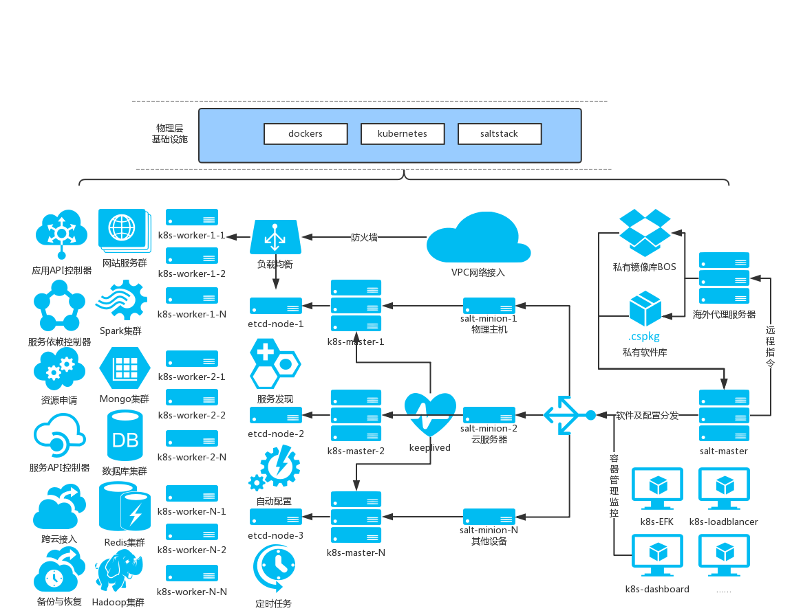
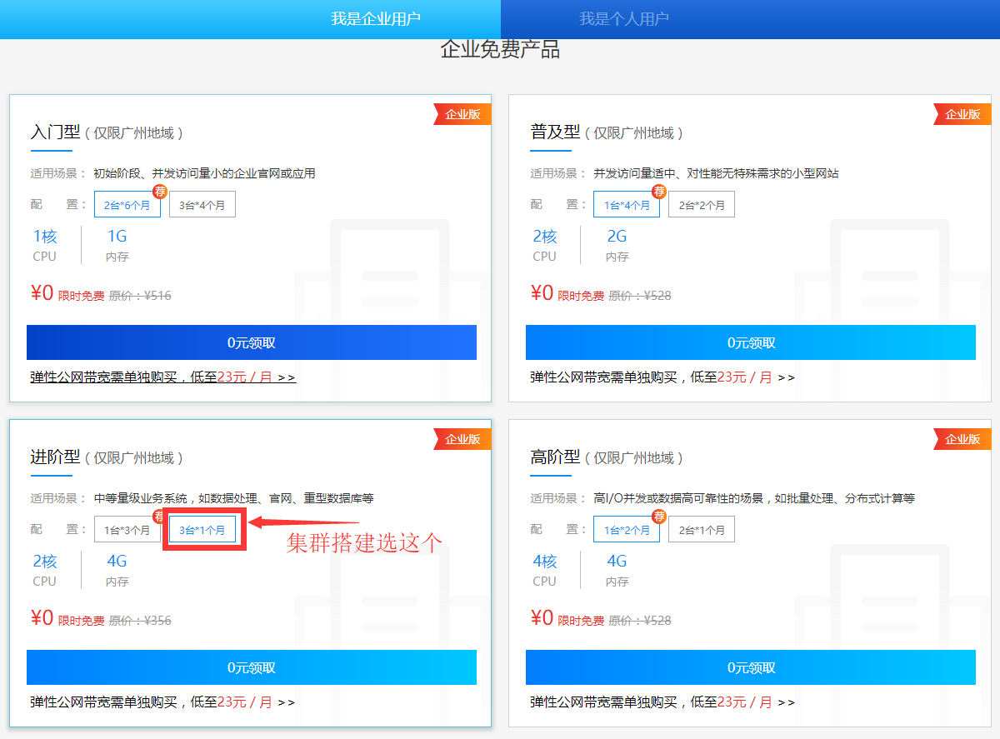

## 从零开始打造语义化视频搜索引擎(一)、SaltStack搭建Kubernetes集群管理架构基础设施

#### 本章知识点
1. [容器化实现分布式系统和水平扩展实践过程中的注意事项](#网络拓扑)
2. [云服务器网络配置及SSH管理](#网络拓扑)
3. [使用salt进行集群文件和配置管理的常用命令](#具体安装步骤)
4. [docker私有镜像仓库registry集成BOS的搭建流程和常规优化配置](#3.)
5. [grains和pillar变量渲染jinra配置模板](#6.)
6. [翻墙进行rpm打包和docker镜像转储的正确姿势](#4.)
7. [操作docker容器时常见错误的排查方式](#3.)
8. [kubernetes集群的搭建、常用操作及调试方法](#7.)
9. [linux中的局域网网络设置和子网划分](#4.)

    以上知识点和本章的操作指令在后续的开发部署中都属于基础范畴,后续将不再对各项指令赘述和解释原理
---
#### 基础设施网络架构

#### 准备工作


[百度云促销活动](https://cloud.baidu.com/event/CloudTimesBCCGZ/index.html?from=index-banner)-企业用户免费领三台2核4G云服务器BCC使用一个月,本计划全部完成后再发出来,可以用这些免费资源供大家上手练习,突然发现==7月7日活动结束==,只好先发这篇完成度较高的基础设施环境搭建来挖个坑。活动领取的服务器在“==华南-广州==”区域,控制台左上角手动切换
1. 安装CentOS 7.2系统镜像,本文以CentOS7为例,其他Linux类似
2. 在控制台初始化重置三台服务器的root密码(不要改hostname)
3. BCC需要绑定外部IP,才能进行外网连接,但他内网默认是互通的,可以访问局域网和BOS,而且网速带宽高达1G/S,理论上使用控制台的VNC结合BOS也可以完成全部构建工作。为了撸码效率,我选择开通EIP来便于使用SSH工具和下载软件
4. 开通BOS的Bucket,设置权限为“私有”,即只允许你本人读写,由于镜像的体积一般较大,为了你的钱包着想请谨慎设置此权限,本实例中是：xf-repo.cdn.bcebos.com

#### 网络拓扑
服务器资源列表分别为：

服务器名 | 内网IP | 外网IP  |  saltstack角色   |kubernetes角色  |etcd
---|---|---|---|---|---
instance-83trene1-1 | 172.16.0.3 | 182.61.50.173   |minion1 |master1 & minion1  |node
instance-83trene1-2 | 172.16.0.5 | 182.61.22.36   |minion2  |master2 & minion2  |node
instance-83trene1-3 | 172.16.0.2 | 182.61.57.29  |master & minion3  |master3 & minion3  |node
proxy | - | 104.131.144.180  |minion4  ||
针对国内众所周知的网络原因,部署思路和流程需要调整为：
1. 创建私有rpm repo和docker registry
2. 使用salt管理所有服务器的配置和执行远程命令
3. 将需要翻墙才能下载的国外软件和容器镜像通过代理下载后,上传到私有库中
4. 按照各服务器的角色,渲染对应配置的脚本进行集群安装
这样规划有几个明显的好处
- 所有主机初次安装minion后只需要在salt-master上操作,避免来回切换导致的误操作,以及长期重复登录可能导致的服务器安全问题
- 所有服务器配置、安装脚本、软件版本、日志设置等全局信息统一管理,规范标准
- 私有库除了探索新天地之外,其本身可作为内部个性化定制容器的存储空间,也提升了容器和数据的安全性和整体研发效率
- 自动化和智能化运维,使开发可以不过多分散精力到底层基础设施资源的编排,更关注于核心业务
- 程序化的运维轻松愉快地管理上千台服务器都不在话下,成就感爆棚
#### 具体安装步骤
##### 1.
在所有服务器安装服务器集群初始化管理工具SaltStack([其他平台参考官方文档](https://repo.saltstack.com/))
- 修改CentOS的yum软件源(国内加速,自带的BCM速度不理想)
```
sudo yum install -y wget
mv /etc/yum.repos.d/CentOS-Base.repo /etc/yum.repos.d/CentOS-Base.repo.backup
sudo wget -O /etc/yum.repos.d/CentOS-Base.repo http://mirrors.aliyun.com/repo/Centos-7.repo
```
- 添加salt源
```
# 添加yum源
sudo yum install -y epel-release
sudo rpm -e --nodeps python2-pycryptodomex
sudo yum install -y python-crypto
sudo yum install -y https://repo.saltstack.com/yum/redhat/salt-repo-latest-2.el7.noarch.rpm
```
- 更新缓存使新源生效
```
sudo yum clean expire-cache -y
sudo yum clean all
sudo yum makecache
```
==注意: 配置文件冒号后的空格不能省略==
- 在选做salt-master的172.16.0.2上安装salt master for centos,打开file-roots用于文件分发,pillar-roots用于配置管理
```
sudo yum install -y salt-master salt-minion
# vim /etc/salt/master
    interface: 0.0.0.0
    auto_accept: True
    file-roots：
        base：
            - /srv/salt
        dev:
            - /srv/salt/dev/services
            - /srv/salt/dev/states
        prod:
            - /srv/salt/prod/services
            - /srv/salt/prod/states
    pillar-roots:
        base:
            - /srv/pillar

ln -s /usr/local/bin/salt-master /usr/bin/
sudo systemctl enable salt-master
sudo systemctl start salt-master
```
- 分别在node172.16.0.2、172.16.0.3和172.16.0.5上安装salt minion for centos
```
sudo yum install -y salt-minion
# vim /etc/salt/minion
    master: 172.16.0.2
    id: `hostname`

ln -s /usr/local/bin/salt-minion /usr/bin/
sudo systemctl enable salt-minion
sudo systemctl start salt-minion
```
python2.7+以上版本
```
wget https://pypi.python.org/packages/2.7/s/setuptools/setuptools-0.6c11-py2.7.egg
sh setuptools-0.6c11-py2.7.egg
wget https://pypi.python.org/packages/source/p/pip/pip-1.5.6.tar.gz#md5=01026f87978932060cc86c1dc527903e
tar xf pip-1.5.6.tar.gz
cd pip-1.5.6
/usr/local/python2.7/bin/python2.7 setup.py install
pip install pip --upgrade
pip install setuptools --upgrade
cat> vim /root/.pip/pip.conf <<EOF
[global]
index-url = https://pypi.mirrors.ustc.edu.cn/simple     # 源地址，末尾需要加上 /simple
[install]
trusted-host=pypi.mirrors.ustc.edu.cn     # 如果使用 https 方式，需要此参数
EOF
yum -y install libyaml m2crypto openpgm pciutils yum-utils zeromq3
pip install babel chardet crypto jinja2 ordereddict requests six urllib3 zmq backports.ssl_match_hostname M2Crypto pycryptodomex
pip isntall salt
```
- 验证被控主机连通性[更多高级用法参考官方文档](https://docs.saltstack.com/en/latest/topics/using_salt.html)
```
## 查看当前的salt key信息
salt-key -L
## 测试被控主机的连通性
salt '*' test.ping
## 远程命令执行测试
salt '*' cmd.run 'uptime'
## 根据被控主机的grains信息进行匹配过滤
salt -G 'os:Centos' test.ping
## 显示被控主机的操作系统类型
salt '*' grains.item os
## 远程代码执行测试
salt '*' cmd.exec_code python 'import sys; print sys.version'
```
确认全部命令执行完成,报错不可怕,能够根据错误检查出问题所在加以解决,可怕的是不报错却没达到预期输出。如存在minion丢失,使用“sudo systemctl status salt-minion -l”进行错误排查
##### 2.
安装并配置docker==以下命令皆在master机上执行即可==
- 系统配置
```
# 关闭防火墙
salt '*' cmd.run 'systemctl disable firewalld && systemctl stop firewalld && systemctl status firewalld'
# 设置SELINUX为permissive模式
salt '*' cmd.run 'sed -i "s/SELINUX=enforcing/SELINUX=permissive/g" /etc/selinux/config'
# 设置iptables参数
salt '*' cmd.run 'tee /etc/sysctl.d/k8s.conf <<-"EOF"
net.bridge.bridge-nf-call-iptables = 1
net.bridge.bridge-nf-call-ip6tables = 1
EOF'
```
- 自动挂载数据盘（如有,推荐）
```
salt '*' cmd.run 'echo "/dev/xvdb1 /data ext3 defaults 0 0">> /etc/fstab'
```
- 批量安装Docker version 1.12+
```
salt '*' cmd.run 'yum -y install docker'
salt '*' cmd.run 'systemctl enable docker'
```
- 配置Docker镜像加速,==注意1.12+使用不同的配置方式==[阿里云可参考：Docker镜像加速](https://cr.console.aliyun.com/?spm=5176.1971733.0.2.vMC3S9#/accelerator)
```
# 添加私有镜像库并使用国内镜像加速
salt '*' cmd.run 'tee /etc/docker/daemon.json <<-"EOF"
{
  "registry-mirrors": ["http://hub-mirror.c.163.com"],
  "insecure-registries":["172.16.0.2:5000","182.61.57.29:5000"]
}
EOF'

# 修改默认存储路径,推荐放到挂载的数据盘
salt '*' cmd.run 'mkdir -p /data/docker'
salt '*' cmd.run 'sed -i "s|ExecStart=/usr/bin/dockerd-current|ExecStart=/usr/bin/dockerd-current --g /data/docker|g" /usr/lib/systemd/system/docker.service'

# 启动docker并检查配置
salt '*' cmd.run 'systemctl daemon-reload && systemctl restart docker && docker info'
```
##### 3.
创建本地私有Docker镜像仓库registry([参考：基于BOS创建registry](http://www.jianshu.com/p/df5e541822ee))和软件仓库。（推荐BOS方式,节省外网流量和磁盘空间,以及更高的安全性和更快的网络速度）项目是在docker开源基础上开发的BOS支持,也可作为go语言的学习资料,根据[源码](https://github.com/docker/distribution)结合自身需求定制编译。
```
mkdir -p /usr/registry/auth && cd /usr/registry
# 配置registry访问密码,私有镜像库的访问权限分配都可以通过此操作完成
yum install -y httpd-tools
htpasswd -Bbn Your_Username Your_Password > auth/htpasswd
docker run -d \
           -v `pwd`/auth:/auth:ro \
           -e REGISTRY_AUTH=htpasswd \
           -e REGISTRY_AUTH_HTPASSWD_REALM=basic-realm \
           -e REGISTRY_AUTH_HTPASSWD_PATH=/auth/htpasswd \
           -e REGISTRY_STORAGE=bos \
           -e REGISTRY_STORAGE_BOS_ACCESSKEYID=Your_AK \
           -e REGISTRY_STORAGE_BOS_ACCESSKEYSECRET=Your_SK \
           -e REGISTRY_STORAGE_BOS_REGION=gz \
           -e REGISTRY_STORAGE_BOS_BUCKET=xf-repo \
           -p 5000:5000 \
           --restart=always \
           --name xf-repo \
           guoyao/registry:0.6.0

# 测试私有镜像库,根据回显同时检查加速器是否生效
docker pull busybox
#docker build -t 182.61.57.29:5000/busybox:origin
#docker commit 182.61.57.29:5000/busybox:origin
docker tag busybox:latest 182.61.57.29:5000/busybox:origin
salt '*' cmd.run 'docker login -u Your_Username -p Your_Password -e Your_Email centos7-bcc1-xf-baidu-cn-guangzhou:5000'
docker push 182.61.57.29:5000/busybox:origin
salt '*' cmd.run 'docker pull 182.61.57.29:5000/busybox'

```
注意cd到registry目录再创建密码表和运行docker,否则会出现路径问题。如果未成功登陆,使用docker命令排查：
```
docker logs <容器ID或NAME>查看运行日志
docker inspect <容器ID或NAME>查看Runtime
```
或者使用以下方法docker进入正在运行的容器
```
yum install -y util-linux
# 首先,计算出你要进入容器的PID：
PID=$(docker inspect --format {{.State.Pid}} <container_name_or_ID>)
PID=$(docker inspect --format {{.State.Pid}} 3d2e168a206f)
# 然后进入容器：
nsenter --target $PID --mount --uts --ipc --net --pid
```
- [~~使用BCE私有镜像仓库(限5个没用)~~](https://cloud.baidu.com/doc/BAE-Pro/GUIGettingStarted/3C.5C.E5.88.B6.E4.BD.9Cdocker.E9.95.9C.E5.83.8F.E7.A4.BA.E4.BE.8B.html)
```
# 用户名和密码为用户账户的AK/SK密码
docker login -u username -p password -e email registry.bce.baidu.com
# UserId即为用户ID,可以在“百度云控制台右上角”的“账户名称->用户信息->基本信息”中查看
docker push registry.bce.baidu.com/UserId/image_name:image_tag
```

以后启动docker容器的流程都是如此：master本地pull或build好image->进行本地安全检查和兼容性测试->有改动的话commit->打好私有库tag->用上一步配置的账户login到私有仓库->push到registry->各个节点再login后从私有的docker镜像仓库中pull。

---
##### 4.
墙外的主机上执行,[推荐DigitalOcean的服务器](https://m.do.co/c/bf7fd732b368)管理方便,连接稳定,居家旅行科学上网必备良梯。
```
# 使用可翻墙的主机下载kubeadm相关的rpm包,然后上传到BOS
cat > /etc/yum.repos.d/kubernetes.repo <<EOF
[kubernetes]
name=Kubernetes
baseurl=https://packages.cloud.google.com/yum/repos/kubernetes-el7-x86_64
enabled=1
gpgcheck=1
repo_gpgcheck=1
gpgkey=https://packages.cloud.google.com/yum/doc/yum-key.gpg
        https://packages.cloud.google.com/yum/doc/rpm-package-key.gpg
EOF

yum install -y --downloadonly docker kubelet kubeadm kubectl kubernetes-cni --downloaddir=~/centos/kubernetes/
## 上传这四个rpm包到国内服务器,目前版本是1.6.6,需要与下面要拉取的镜像对应
scp -r ~/centos/kubernetes/ root@182.61.57.29:/srv/salt/rpm

# 根据docker版本,增加私有库外网访问白名单(未绑定域名和TLS的访问方式)
sed -i "s|ExecStart=/usr/bin/dockerd-current|ExecStart=/usr/bin/dockerd-current --insecure-registry 182.61.57.29:5000|g" /usr/lib/systemd/system/docker.service

# 创建google镜像拉取和推送到上一节建立的私有镜像库,过程中会要求登录
tee ~/down4china.sh <<-EOF
#!/usr/bin/env bash
registry='182.61.57.29:5000'
docker login $registry
images=(
    kube-proxy-amd64:v1.6.6
    kube-controller-manager-amd64:v1.6.6
    kube-apiserver-amd64:v1.6.6
    kube-scheduler-amd64:v1.6.6
    kubernetes-dashboard-amd64:v1.6.0
    k8s-dns-sidecar-amd64:1.14.1
    k8s-dns-kube-dns-amd64:1.14.1
    k8s-dns-dnsmasq-nanny-amd64:1.14.1
    etcd-amd64:3.0.17
    pause-amd64:3.0
)

for imageName in ${images[@]} ; do
    docker pull gcr.io/google_containers/$imageName
    docker tag gcr.io/google_containers/$imageName $registry/$imageName
    docker push $registry/$imageName
done

docker pull quay.io/coreos/flannel:v0.8.0-rc1-amd64
docker tag quay.io/coreos/flannel:v0.8.0-rc1-amd64 $registry/flannel:v0.8.0-rc1-amd64
docker push $registry/flannel:v0.8.0-rc1-amd64
EOF

chmod +x ~/down4china.sh
~/down4china.sh

```
上面一段操作在你翻墙的主机上完成,以下仍全在master上执行,也可以通过salt分配角色来远程操作,由于本文只用了一台翻墙服务器,暂时独立操作。下一章我们会专门介绍使用salt的grains分组和角色管理不同类型服务器。此外rpm包也可以通过clone k8s源码包进行编译的的形式生成,[go](https://github.com/golang/go)、[kubernetes](https://github.com/kubernetes/kubernetes)、[prometheus](https://github.com/prometheus/prometheus)、[docker](https://github.com/docker/docker-ce)、[etcd](https://github.com/coreos/etcd)、[flannel](https://github.com/coreos/flannel/)包括我们即将开发的搜索引擎,全部开发语言选型都是天生适用于高性能高并发需求的Go。
##### 5.
在所有minion上安装rpm软件包
```
# 分发上传到服务器的rpm包到各minion
salt "*" cp.get_dir salt://rpm /tmp makedirs=True gzip=9
# 安装rpm包
salt "*" cmd.run 'yum install -y /tmp/rpm/*.rpm'

```
##### 6.
salt的pillar提供统一的集群配置模板管理,是实现自动化运维的关键所在,所使用的jinra模板引擎,类似于PHP的MVC,易于理解和使用。要注意sls配置文件的yaml强制约定以两个空格作为缩进,“:”和键值之间必须有至少一个空格。使用salt集群化安装和配置kubernetes、etcd、flannel（参考来源:[I:shdowsocks自用梯子的搭建和优化](http://note.youdao.com/noteshare?id=c2087b3ba10809abf605d8068d94b25d&sub=CF294ADF75E14B5EA0382D2E0E8D2286)、[II:kubeadm(安装过程需科学上网)](https://kubernetes.io/docs/setup/independent/create-cluster-kubeadm/)、[III:kubeadm国内安装](https://my.oschina.net/xdatk/blog/895645?nocache=1498467713064)、[IV:手动搭建kubernetes集群](https://github.com/opsnull/follow-me-install-kubernetes-cluster)、[一键部署Kubernetes高可用集群](http://www.cnblogs.com/keithtt/p/6649995.html)、[V:kubeadm v1.6.6的一些注意事项](http://blog.csdn.net/tiger435/article/details/73996078)、[VI:kubeadm HA](https://github.com/cookeem/kubeadm-ha)）
- 创建集群环境配置文件模板
```
tee /srv/pillar/top.sls <<-EOF
base:
  '*':
    - env
EOF
```
```
# 全局环境变量
tee /srv/pillar/env.sls <<-EOF
appname: kubernetes
kube_servers:
  master:
    - 172.16.0.2
    - 172.16.0.3
    - 172.16.0.5
  node:
    - 172.16.0.2
    - 172.16.0.3
    - 172.16.0.5
repo:
  host: 182.61.57.29
  port: 5000
proxy:
  host: 104.131.144.180
etcd_prefix: http
etcd_endpoint_port: '2379'
etcd_node_port: '2380'
zabbix_master: 182.61.57.29
service_cidr: 10.254.0.0/16
cluster_cidr: 172.30.0.0/16
cluster_service_ip: 10.254.0.1
cluster_server_ip: 182.61.57.29
cluster_server_port: 6443
cluster_dns: 10.254.0.2
cluster_domain: cluster.local
# 镜像版本清单,进行版本管理
etcd_version: 3.0.17
kube_version: v1.6.6
pause_version: 3.0
flannel_version: v0.8.0-rc1-amd64
k8s_dashboard_version: v1.6.1
k8s_dns_version: 1.14.2
EOF
```
- 配置通用环境安装脚本
```
tee /srv/salt/usr/local/environment.sls <<-EOF
kubernetes:
  file.managed:
    - source: salt://usr/local/environment.sh
    - name: /usr/local/environment.sh
    - template: jinja
    - defaults:
      appname: {{ pillar['appname'] }}
      repo_prefix: {{ pillar['repo']['host'] }}:{{ pillar['repo']['port'] }}
      kube_version: {{ pillar['kube_version'] }}
      etcd_version: {{ pillar['etcd_version'] }}
      cluster_dns: {{ pillar['cluster_dns'] }}
      cluster_cidr: {{ pillar['cluster_cidr'] }}
      service_cidr: {{ pillar['service_cidr'] }}
      cluster_service_ip: {{ pillar['cluster_service_ip'] }}
      cluster_server_ip: {{ pillar['cluster_server_ip'] }}
      cluster_domain: {{ pillar['cluster_domain'] }}
EOF
```

```
tee /srv/salt/usr/local/environment.sh <<-EOF
export SERVICE_CIDR={{ service_cidr }}
export CLUSTER_CIDR={{ cluster_cidr }}
export FLANNEL_ETCD_PREFIX=/{{ appname }}/network
export CLUSTER_KUBERNETES_SVC_IP={{ cluster_service_ip }}
export CLUSTER_DNS_SVC_IP={{ cluster_dns }}
export CLUSTER_DNS_DOMAIN={{ cluster_domain }}
export KUBE_REPO_PREFIX={{ repo_prefix }}
export KUBE_ETCD_IMAGE={{ repo_prefix }}/etcd-amd64:{{ etcd_version }}
export KUBE_VERSION={{ kube_version }}
EOF
```
- kubeadm安装脚本初始化配置,注意其中对变量的处理,更新时对照安装命令所支持的参数进行调整
```
mkdir -p /srv/salt/usr/local/kubernetes/
tee /srv/salt/usr/local/kubernetes/kubeadm.sls <<-EOF
kubernetes:
  file.managed:
    - source: salt://usr/local/kubernetes/kubeadm.conf
    - name: /etc/systemd/system/kubelet.service.d/10-kubeadm.conf
    - template: jinja
    - defaults:
      repo_prefix: {{ pillar['repo']['host'] }}:{{ pillar['repo']['port'] }}
      cluster_dns: {{ pillar['cluster_dns'] }}
      cluster_server_ip: {{ pillar['cluster_server_ip'] }}
      cluster_cidr: {{ pillar['cluster_cidr'] }}
      cluster_domain: {{ pillar['cluster_domain'] }}
      cluster_etcd_endponits: {{ pillar['etcd_prefix'] }}://{{ server }}:{{ pillar['etcd_endpoint_port'] }},{{pillar['etcd_prefix'] }}://
      pause_version: {{ pillar['pause_version'] }}
EOF
```
```
tee /srv/salt/usr/local/kubernetes/kubeadm.conf <<-EOF
[Service]
Environment="KUBELET_KUBECONFIG_ARGS=--kubeconfig=/etc/kubernetes/kubelet.conf --require-kubeconfig=true"
Environment="KUBELET_SYSTEM_PODS_ARGS=--pod-manifest-path=/etc/kubernetes/manifests --allow-privileged=true"
Environment="KUBELET_NETWORK_ARGS=--network-plugin=cni --cni-conf-dir=/etc/cni/net.d --cni-bin-dir=/opt/cni/bin"
Environment="KUBELET_DNS_ARGS=--cluster-dns={{ cluster_dns }} --cluster-domain={{ cluster_domain }}"
Environment="KUBELET_AUTHZ_ARGS=--authorization-mode=Webhook --client-ca-file=/etc/kubernetes/pki/ca.crt"
Environment="KUBELET_CGROUP_ARGS=--cgroup-driver=systemd"
Environment="KUBELET_REPO_ARGS=--pod-infra-container-image={{ repo_prefix }}/pause-amd64:{{ pause_version }}"
#Environment="KUBELET_INSECURE_ARGS=--insecure-bind-address=0.0.0.0 --insecure-port=8080"
Environment="KUBELET_LOG_ARGS=--log-dir=/var/log/kube-apiserver --logtostderr=true"
Environment="KUBELET_EXTRA_ARGS="
ExecStart=
ExecStart=/usr/bin/kubelet \$KUBELET_KUBECONFIG_ARGS \$KUBELET_SYSTEM_PODS_ARGS \$KUBELET_DNS_ARGS \$KUBELET_AUTHZ_ARGS \$KUBELET_CGROUP_ARGS \$KUBELET_REPO_ARGS \$KUBELET_LOG_ARGS \$KUBELET_INSECURE_ARGS \$KUBELET_EXTRA_ARGS
EOF
```
- kubernetes 集群master初始化脚本
```
mkdir -p /srv/salt/usr/local/kubernetes
tee /srv/salt/usr/local/kubernetes/kubemaster.sls <<-EOF
kubernetes:
  file.managed:
    - source: salt://usr/local/kubernetes/kubemaster.sh
    - name: /usr/local/kubernetes/kubemaster.sh
    - template: jinja
    - defaults:
      repo_prefix: {{ pillar['repo']['host'] }}:{{ pillar['repo']['port'] }}
      cluster_dns: {{ pillar['cluster_dns'] }}
      cluster_server_ip: {{ pillar['cluster_server_ip'] }}
      cluster_server_port: {{ pillar['cluster_server_port'] }}
      cluster_cidr: {{ pillar['cluster_cidr'] }}
      cluster_domain: {{ pillar['cluster_domain'] }}
      service_cidr: {{ pillar['service_cidr'] }}
      pause_version: {{ pillar['pause_version'] }}
      kube_version: {{ pillar['kube_version'] }}
      etcd_version: {{ pillar['etcd_version'] }}
      flannel_version: {{ pillar['flannel_version'] }}
      k8s_dashboard_version: {{ pillar['k8s_dashboard_version'] }}
      k8s_dns_version: {{ pillar['k8s_dns_version'] }}
EOF
```
```
tee /srv/salt/usr/local/kubernetes/kubemaster.sh <<-EOF
images=(
    kube-proxy-amd64:{{ kube_version }}
    kube-controller-manager-amd64:{{ kube_version }}
    kube-apiserver-amd64:{{ kube_version }}
    kube-scheduler-amd64:{{ kube_version }}
    kubernetes-dashboard-amd64:{{ k8s_dashboard_version }}
    k8s-dns-sidecar-amd64:{{ k8s_dns_version }}
    k8s-dns-kube-dns-amd64:{{ k8s_dns_version }}
    k8s-dns-dnsmasq-nanny-amd64:{{ k8s_dns_version }}
    etcd-amd64:{{ etcd_version }}
    pause-amd64:{{ pause_version }}

    # 以下镜像用于安装addons,网络组件flannel替换为weave
    # flannel:{{ flannel_version }}
    etcd-empty-dir-cleanup:3.0.14.0
    elasticsearch:v2.4.1-2
    fluentd-elasticsearch:1.23
    kibana:v4.6.1-1
    event-exporter:v0.1.0-r2
    prometheus-to-sd:v0.1.2-r2
    fluentd-gcp:2.0.7
    ip-masq-agent-amd64:v2.0.2
    metadata-proxy:0.1.2
    node-problem-detector:v0.4.1
    node:v1.3.0
    cni:v1.9.1
    typha:v0.2.2
    defaultbackend:1.3
    heapster-amd64:v1.4.0-beta.0
    heapster-influxdb-amd64:v1.1.1
    heapster-grafana-amd64:v4.0.2
    addon-resizer:1.7
    cluster-proportional-autoscaler-amd64:1.1.2-r2
    weaveworks/weave-kube:latest
    weaveworks/weave-npc:latest
)
# 此处使用私有镜像库配置的账号密码
salt '*' cmd.run 'docker login -u Your_Username -p Your_Password -e Your_Email {{ repo_prefix }}'

for imageName in \${images[@]} ; do
    docker pull {{ repo_prefix }}/\$imageName
done
export KUBE_REPO_PREFIX="{{ repo_prefix }}"
export KUBE_ETCD_IMAGE="{{ repo_prefix }}/etcd-amd64:{{ etcd_version }}"
#source /usr/local/environment.sh
ip addr add {{ cluster_cidr }} dev eth0
kubeadm init --kubernetes-version={{ kube_version }} --pod-network-cidr={{ cluster_cidr }} --service-cidr={{ service_cidr }}
mkdir -p ~/.kube
alias cp='cp'
cp /etc/kubernetes/admin.conf ~/.kube/config
alias cp='cp -i'
#chown $(id -u):$(id -g) ~/.kube/config
#export KUBECONFIG=~/.kube/config
#kubectl taint nodes --all node-role.kubernetes.io/master-
EOF

```
这里有个来回折腾了我三天的大坑,注意不能修改实例名,改过的要改回和初始时短信中的一致,否则启动kubeadm init会一直卡住,kubelet报6443: getsockopt: connection refused,BCC坑货默认就是改了的。改好重启后reset 重新初始化~~还有一个原因是各个镜像因为DNS或者访问私有库的原因hang住了,在脚本中先pull需要的镜像来解决
```
# 渲染kubeadm环境配置文件,去除有问题的参数KUBELET_NETWORK_ARGS
salt '*' saltutil.refresh_pillar
salt '*' cmd.run 'mkdir -p /usr/local/kubernetes'
salt '*' state.sls usr.local.kubelet.kubeadm

#如果安装过程出错,重置时由此开始
#salt '*' cmd.run 'kubeadm reset'
#salt "*" cmd.run 'systemctl daemon-reload && systemctl enable kubelet'
#salt "*" cmd.run 'systemctl enable docker && systemctl restart docker && systemctl status docker'

# 渲染环境配置文件修改基础容器为私有源
#salt '*' state.sls usr.local.environment
#salt '*' cmd.run 'source /usr/local/environment.sh'

salt '*' state.sls usr.local.kubelet.kubemaster
#salt '*' cmd.run 'chmod +x /usr/local/kubernetes/kubemaster.sh && /usr/local/kubernetes/kubemaster.sh'
chmod +x /usr/local/kubernetes/kubemaster.sh && /usr/local/kubernetes/kubemaster.sh
```
- 执行成功后获得master的token和配置文件,使用salt分别加入节点,此时安装完成的是独立的kubernetes master节点,现在我们来进行集群配置
```
#journalctl -u kubelet -f 查看服务运行状态调试
# 首先安装weave网络,这地方也踩了两天flannel坑,测试了0.7.0到0.8.0-rc1都不支持k8s v1.6,最后改用weave,weave-kube和weave-npc镜像也最好拉到私有库,否则从docker.io拉取仍然很慢
kubectl apply -f  https://raw.githubusercontent.com/weaveworks/weave/master/prog/weave-kube/weave-daemonset-k8s-1.6.yaml
kubectl get pods --all-namespaces
#cp -R /etc/kubernetes /srv/salt/etc/
# 将其他两台的k8s添加node到master
salt '*' cmd.run 'kubeadm join --token 99d371.26728f098ab01231 182.61.57.29:6443'

```
- 检查安装的pods状态
```
# kubectl get pods --all-namespaces
NAMESPACE     NAME                                          READY     STATUS    RESTARTS   AGE
kube-system   etcd-instance-83trene1-3                      1/1       Running   0          15h
kube-system   heapster-948185719-56nq2                      1/1       Running   0          15h
kube-system   kube-apiserver-instance-83trene1-3            1/1       Running   0          15h
kube-system   kube-controller-manager-instance-83trene1-3   1/1       Running   0          15h
kube-system   kube-dns-668322164-wx34k                      3/3       Running   0          15h
kube-system   kube-proxy-hkvw8                              1/1       Running   0          15h
kube-system   kube-proxy-krp81                              1/1       Running   0          15h
kube-system   kube-proxy-nlp1h                              1/1       Running   0          15h
kube-system   kube-scheduler-instance-83trene1-3            1/1       Running   0          15h
kube-system   monitoring-influxdb-2556025100-726zt          1/1       Running   0          15h
kube-system   weave-net-fsssz                               2/2       Running   0          14h
kube-system   weave-net-fvndp                               2/2       Running   0          14h
kube-system   weave-net-p1skv                               2/2       Running   0          14h
```
如果STATUS存在异常状态,使用"kubectl describe pod <pod-name>"追踪调试

ImagePullBackOff / ErrImagePull: 核对yaml中指定的镜像能否正常拉取,包括网络问题,标签tag是否对应,私有库是否已经登录并权限正确等原因.可尝试==在所分配的节点上==pull该镜像再用“kubectl apply -f <pod-filename>”拉取

CrashLoopBackOff: 使用"kubectl logs <pod-name> --previous",重点检查是否缺失环境变量或者挂载卷路径不存在之类的io问题

RunContainerError: ConfigMap 或者Secrets

ContainerCreating: 卡在这个状态的使用describe

- 排查启动问题无误后,分发[所需要安装addons的ConfigMap](https://github.com/kubernetes/kubernetes/tree/master/cluster/addons),==将其中的docker源修改为我们的私有镜像库地址==然后创建容器,k8s会自动将任务部署到集群不同节点.关于不同应用的configmap语法,会在接下来的DevOps环境搭建中详述
```
# cd <path>/<to>/<mainfest>
# kubectl create -f .
deployment "kubernetes-dashboard" created
clusterrolebinding "dashboard-admin" created
service "kubernetes-dashboard" created
deployment "heapster" created
serviceaccount "heapster" created
clusterrolebinding "heapster" created
service "heapster" created
configmap "influxdb-config" created
deployment "monitoring-influxdb" created
service "monitoring-influxdb" created
serviceaccount "weave-net" created
clusterrole "weave-net" created
clusterrolebinding "weave-net" created
daemonset "weave-net" created
# kubectl get service --all-namespaces
NAMESPACE     NAME                   CLUSTER-IP       EXTERNAL-IP   PORT(S)                         AGE
default       kubernetes             10.254.0.1       <none>        443/TCP                         15h
kube-system   heapster               10.254.61.21     <none>        80/TCP                          1m
kube-system   kube-dns               10.254.0.10      <none>        53/UDP,53/TCP                   15h
kube-system   kubernetes-dashboard   10.254.164.157   <nodes>       80:30106/TCP                    1m
kube-system   monitoring-influxdb    10.254.148.79    <nodes>       8086:32020/TCP,8083:30462/TCP   1m
```

以上命令正确运行后,使用三台主机的任一节点IP:对外端口即可访问服务

---

做了个kubectl与docker的对比表,方便大家加深理解

attribute   |docker | kubernetes
---|---|---
配置文件   |yaml   |configmap
容器名称   |container  | pods,service,rc
编排指令   |docker-compose  |kubectl
编排工具    |docker-composer  |kubectl
内部连接    |link   |deployments
持久存储    |volume |persistent-volumes
网络配置    |network    |flennel/weave
高可用      |   |etcd
日志查看    |logs   |logs
运行参数    |inspect    |describe
功能特性    |start/stop |create/delete/rollback/jobs/scheduled/petset
节点调度    |-   |auto
安全控制    |system |rbac

##### 7.
至此我们根据架构图构建了由3台服务互为主从的基础设施集群,三台mater组成的集群通过keeplived实现HA（参考来源:[Building High-Availability Clusters](https://kubernetes.io/docs/admin/high-availability/)、[基于Kubeadm的高可用Kubernetes集群](http://tonybai.com/2017/05/15/setup-a-ha-kubernetes-cluster-based-on-kubeadm-part1/)）
```
salt '*' cmd.run 'yum install -y keepalived'
mkdir /srv/salt/etc/keepalived
#cp /etc/keepalived/keepalived.conf /srv/salt/etc/keepalived
tee /srv/salt/etc/keepalived/keepalived.sls <<-EOF
kubernetes:
  file.managed:
    - source: salt:///etc/keepalived/keepalived.conf
    - name: /etc/keepalived/keepalived.conf
    - template: jinja
    - defaults:
      node_ip: {{ grains[ipv4][1] }}
      cluster_servers_master: {{ pillar['cluster_servers']['master'] }}
      cluster_server_ip: {{ pillar['cluster_server_ip'] }}
      cluster_server_port: {{ pillar['cluster_server_port'] }}
      repo_prefix: {{ pillar['repo']['host'] }}:{{ pillar['repo']['port'] }}
      cluster_dns: {{ pillar['cluster_dns'] }}
      cluster_cidr: {{ pillar['cluster_cidr'] }}
      cluster_domain: {{ pillar['cluster_domain'] }}
EOF

tee /srv/salt/etc/keepalived/keepalived.conf <<-EOF
global_defs {
   router_id LVS_k8s
}

vrrp_script CheckK8sMaster {
    script "curl -k https://{{ node_ip }}:{{ cluster_server_port }}"
    interval 3
    timeout 9
    fall 2
    rise 2
}

vrrp_instance VI_1 {
    state MASTER
    interface eth0
    virtual_router_id 61
    priority 115
    advert_int 1
    mcast_src_ip {{ node_ip }}
    nopreempt
    authentication {
        auth_type PASS
        auth_pass sqP05dQgMSlzrxHj
    }
    unicast_peer {
        
        {% if server==node_ip}server
        {% endif}
        
    }
    virtual_ipaddress {
        {{ cluster_cidr }}
    }
    track_script {
        CheckK8sMaster
    }

}
EOF

salt '*' state.sls etc.keepalived
salt '*' cmd.run 'systemctl enable keepalived && systemctl restart keepalived'
```

这里的架构图直接应用kubernetes官方的HA建议性指南[Building High-Availability Clusters](https://kubernetes.io/docs/admin/high-availability/)三台服务器互为主从,一台挂掉后,负载均衡就调度剩余两台,目前的1.6版本还不支持k8s内部pod的HA,根据[里程碑计划将在v1.8中实现](https://github.com/kubernetes/kubeadm/issues/261),预计两个月后,届时我们更新此文再做升级。对外发布配置外部DNS轮询或负载均衡能够进一步提升可用性,K8S有自带cluster-loadbalancing组件,即插即用
##### 8.
集群中新增物理主机时的发现与并网流程
```
分配主机名,根据角色执行初始化
初始化流程：
根据VPC解析/etc/host,网络连通
安装salt-minion,配置master连接,根据角色执行初始化脚本
如果新增mater:更新集群配置->salt state.sls 分发环境配置-> kubeadmin init
如果新增minion:直接加入kubeadm join --token <token> <master-ip>:<master-port>
简单两步即可搞定,使用salt可在master上完成所有操作。
```
&#160; &#160; &#160; &#160;另外一种更imba的方案,是将master和worker在初始化前分别制作成系统镜像,增加新的服务器时,直接载入配置好的系统镜像。结合zabbix作为主机自动发现,当网段中的DHCP有新主机加入时,能够按预设规则自动添加node。某台主机故障时,向管理员发出警报,并自动将其从网络中排除,检测到故障排除后再重新连入集群。麻烦一点的地方是每次更新配置的同时需要更新镜像,才能保证新加入的主机同步,已发布的服务器更新配置仍然需要salt进行分发。

&#160; &#160; &#160; &#160;这套基础设施架构中,将所有设备,无论数据中心机房中的物理主机,还是各大云平台上的云服务器、公有云、私有云、混合云,只要网络VPC能够接通,都被抽象成了系统统一调配管理的资源,经过master的服务发现、自动调度、负载均衡、安全监控、高可用等措施的保障,进一步提高集群自动化程度和运维效率。只要附加一套计费体系,就可以做公有云服务商了,你值得拥有:)

&#160; &#160; &#160; &#160;至此整个私有集群的基础设施搭建完毕,稳定健壮且可无限水平扩展,运维管理更是轻松愉快,升级主机数量、硬件配置、软件版本、容器镜像时只需要在配置文件中更新即可,并且能够在秒级时间内完成,还支持系统动态更新,版本回滚。

&#160; &#160; &#160; &#160;相对于开发环境,生产环境在功能实现的基础上,还需要关注安全策略、成本控制、CDN缓存、负载均衡、系统性能、集群伸缩、服务发现、状态监控、持久化、主从设置、读写分离、弹性扩容、日志存储、大数据、快照备份、异地灾备等需求,大部分灵活运用云服务器提供的功能可以多快好省地实现。但就像我们即将要做的实际项目一样,总有一些核心的东西必须我们自己动手才能搞定,都可以在这套基础设施上通过kubernetes的configmap或者salt的sls比较容易地做到,在接下来的工作中也会更多地涉及,需要进行调整时将继续使用本章的基础知识进行管理。

---
&#160; &#160; &#160; &#160;题外话：看到这的同学可能已经发现的salt可以用来干什么了……没错,那就是可以由master随意控制成千上万台的僵尸网络,再配合kubernetes单服务器自动节点部署上千台虚拟机并秒级启动的支持,扑面而来的速8即视感。并且其客户端仅仅34KB~还[支持几乎所有操作系统](https://repo.saltstack.com/)（包括Debian、Red Hat / CentOS、Ubuntu、SUSE、Fedora、Windows、macOS、Amazon Linux、Raspbian等等,甚至经过环境适配[iOS](https://github.com/pybee/Python-Apple-support)和[Android](http://qpython.com/)）也能做到,这样受控设备就不仅限于服务器,个人电脑、电视、手机、汽车或是物联网设备,只要联网都在其控制范围内。这把刀既可以用来切菜,更可以用来打劫,作为一个IT工作者的职业操守来说,笔者有句话送给大家：

创造一个世界,要比摧毁一个世界,永远要更困难,也更有价值和意义。

服务器管理员也需要注意,这个世界上总会有不怀好意的人,人不犯我我不犯人,人若犯我我就提高安全意识,拒绝裸奔:)

下一章我们将在这些基础设施之上,使用pod安装k8s的监控插件和其他DevOps组件,搭建开发支持系统,进一步熟悉容器的管理和操作,为正式开发应用准备高效率的开发和测试环境

---
#### [章节目录](#本章知识点)
- [始、有一个改变世界的idea，就缺个程序员了](始、有一个改变世界的idea，就缺个程序员了.md)
- **[一、SaltStack搭建Kubernetes集群管理架构基础设施](一、SaltStack搭建Kubernetes集群管理架构基础设施.md)**
- [二、EFK+Prometheus可扩展的DevOps自动化运维部署及监控体系](二、EFK+Prometheus可扩展的DevOps自动化运维部署及监控体系.md)
- [三、使用Python的Scrapy开发分布式爬虫进行数据采集](三、使用Python的Scrapy开发分布式爬虫进行数据采集.md)
- [四、VCA+go打造高性能语义化视频搜索引擎](四、VCA+go打造高性能语义化视频搜索引擎.md)
- [五、Hadoop+Spark-Streaming+GraphX实现大数据的流式计算和可视化](五、Hadoop+Spark-Streaming+GraphX实现大数据的流式计算和可视化.md)
- [六、ReactXP开发跨全平台的客户端程序](六、ReactXP开发跨全平台的客户端程序.md)
- [七、将用户行为反馈接入机器学习框架TensorFlow进行算法调优](七、将用户行为反馈接入机器学习框架TensorFlow进行算法调优.md)
- [终、以终为始,不是终点的终点](终、以终为始,不是终点的终点.md)