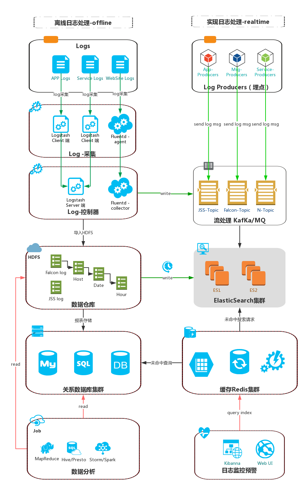
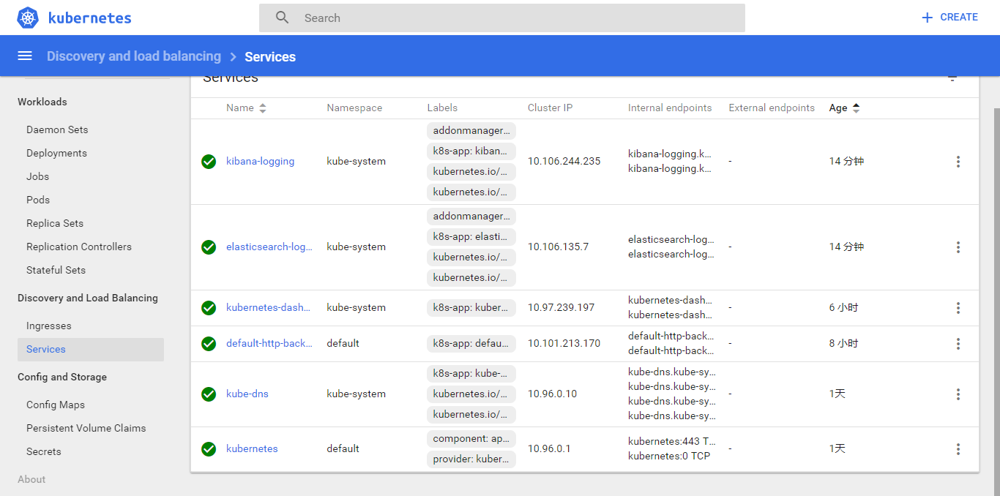

## 从零开始构建语义化视频搜索引擎(二)、EFK+Prometheus可扩展的DevOps自动化运维部署及监控体系
#### 本章知识点
1. [salt分组和OS自动化管理多种类型服务器](#salt分组管理)
2. [全局统一规范化编码及日志格式约定](#编码规范)
3. [Kubernetes启动pod的yaml文件编写](#本章知识点)
4. [集成通用日志采集和监控平台EFK用于开发调试](#本章知识点)
5. [将Prometheus与Kubernetes集成实现服务器运行状态监控](#本章知识点)
6. [Gitlab搭建本地代码库并触发自动集成CI](#6-10)
7. [实现多种编程语言自动部署CD及其替代方案](#6-10)
8. [Jenkins插件SonarQube执行代码规范和安全性检查](#6-10)
9. [自动化测试框架解决方案](#6-10)
10. [实施敏捷开发必备的产品迭代工具：项目、bug、需求、优化、协作……集成管理平台](#6-10)
---
#### 开发支持体系之日志采集和监控EFK平台架构图


#### salt分组管理
- 部署镜像环境,由于minion新增了一台代理服务器,为避免误操作,所以本章开始按角色分组执行命令

[操作目标参数](http://www.cnblogs.com/MacoLee/p/5750310.html):
-E，--pcre，通过正则表达式进行匹配:
```
salt -E '^SN2013.*' test.ping #探测SN2013开头的主机id名是否连通
salt '*.doam.net' test.ping--------匹配以*.doam.net的
salt '*.doam.*' test.ping----------匹配中间为doam的
salt 'web?.doam.*' test.ping-------一个问号表示统配一个，多个表示通赔多个
salt 'web[1-5]' test.ping----------1-5,通赔以web开头的1-5的id
salt 'web[1，3]' test.ping---------统配以web开头，1和3的id
salt 'web[x-z]' test.ping----------统配以web开头，x到z结尾的id
```
-L，--list，以主机id名列表的形式进行过滤，格式与Python的列表相似，即不同主机id名称使用逗号分离。
```
salt -L 'SN2013-08-021,SN2013-08-021' grains.item osfullname #获取主机id为：SN2013-08-021,SN2013-08-021完整操作系统发行版名称
```
-G，--grain,根据被控主机的grains信息进行匹配过滤，格式为：<grain value>:<grain expression>
```
salt -G 'osrelease:6.4' cmd.run 'python -V' #获取发行版本号为6.4的python版本号
```
-I,--pillar,根据被控主机的pillar信息进行匹配过滤，格式为："对象名称":"对象值"
```
salt -I 'nginx:root:/data' test.ping #探测具有'nginx:root:/data'信息的连通性。
```
#pillar属性配置文件如下：
nginx:
  root: /data

-N,--nodegroup,根据主控端master配置文件中的分组名称进行过滤。
```
#分组配置：【/etc/salt/master】
```
nodegroups:
  k8s-master: 'centos7-bcc1-xf-baidu-cn-guangzhou'
  k8s-worker: 'centos7-bcc2-xf-baidu-cn-guangzhou,centos7-bcc3-xf-baidu-cn-guangzhou'
```
#其中L@表示后面的主机id格式为列表，即主机id以逗号分隔：G@表示以grain格式描述：S@表示以IP子网或地址格式描述
salt -N k8s-worker test.ping #探测web2group被控主机的连通性
```
-C,--compound,根据条件运算符not、and、or去匹配不同规则的主机信息
```
salt -C 'E@^SN2013.* and G@os:Centos' test.ping #探测SN2013开头并且操作系统版本为CentOS的主机的连通性
```
-S,--ipcidr,根据被控主机的IP地址或IP子网进行匹配
```
salt -S 192.168.0.0/16 test.ping
salt -S 192.168.1.10 test.ping
```
salt的nodegroup分组时可以用到的语法关键字：
字母|含义|例子
--|--|--
G  |Grains glob |G@os:CentOS
E  |PCRE Minions id |E@web\d+\.(dev|qa|prod)\.loc
P  |Grains PCRE  |P@os:(RedHat|Fedora|CentOS)
L  |Minions List  |L@minion1.example,minion2.example,dev*.example
I  |Pillar glob   |I@pdata:foobar
S  |IP  |S@192.168.1.0/24 or S@192.168.1.200
R  |Range cluster  |R@foo.bar
D  |Minions Data  |D@key:value

在top.sls中可以如下使用:
```
base:
  '*baidu-cn-guangzhou and G@os:CentOS or E@web-dc1-srv.*':
    – match: compound
    – k8s-cluster
```
使用'salt -N [GroupName] test.ping'测试,有新主机加入时minion id按照约定规则即可
- 配置不同角色服务器所要执行的命令
- 查看指定角色任务执行情况salt 'proxy' saltutil.running
docker 会自行检查并跳过已经拉取和推送过的镜像版本,如果有新镜像或版本会更新
- 使用pillar管理镜像和安装包版本,代理在软件和后面的爬虫中都有广泛应用
- 如果执行过程有配置或语法错误,使用"tail -n 50 /var/log/salt/master"跟踪日志
```
tee /srv/pillar/top.sls <<-EOF
base:
  '*':
    - env
    - proxy
EOF

# 全局环境变量和版本控制
tee /srv/pillar/env.sls <<-EOF
appname: kubernetes
servers:
  custom_ssh_port: 51222
  master:
    cn-gz-baidu-xf-bcc-1: 172.16.0.2
    cn-gz-baidu-xf-bcc-2: 172.16.0.3
    cn-gz-baidu-xf-bcc-3: 172.16.0.5
registry:
  host: 182.61.57.29
  port: 5000
  username: YOUR_REGISTRY_USERNAME
  password: YOUR_REGISTRY_PASSWORD
proxy:
  host: 104.131.144.180
  port: 22
  username: YOUR_PROXY_USERNAME
  password: YOUR_PROXY_PASSWORD
etcd:
  prefix: http
  endpoint_port: '2379'
  node_port: '2380'
zabbix_master: 182.61.57.29
cluster:
  master: 172.16.0.2
  cidr: 172.30.0.0/16
  service_cidr: 10.254.0.0/16
  service_ip: 10.254.0.1
  dns: 10.254.0.2
  apiserver_port: 6443
  domain: cluster.local

packages:
  HTTP_SERVER: xf-repo.cdn.bcebos.com
  rpms:
    centos7:
      common:
        util-linux: 2.23-33
        httpd-tools: 2.4.6-45
      docker:
        docker-client: 1.12.6-32
        docker-common: 1.12.6-32
      salt:
        salt-master: 2016.11.5-3
        salt-minion: 2016.11.5-3
        salt-repo: latest-2
      kubernetes:
        kubelet: 1.6.6
        kubeadm: 1.6.6
        kubectl: 1.6.6
        kubernetes-cni: 0.5.1
  images:
    docker.io:
      weaveworks:
        weave-kube: latest
        weave-npc: latest
    gcr.io:
      google_containers:
        kube-proxy-amd64: v1.6.6
        kube-controller-manager-amd64: v1.6.6
        kube-apiserver-amd64: v1.6.6
        kube-scheduler-amd64: v1.6.6
        kube-discovery-amd64: 1.0
        k8s-dns-sidecar-amd64: 1.14.2
        k8s-dns-kube-dns-amd64: 1.14.2
        k8s-dns-dnsmasq-nanny-amd64: 1.14.2
        etcd-amd64: 3.0.17
        pause-amd64: 3.0
        #
        kubernetes-dashboard-amd64: v1.6.1
        nginx-ingress-controller: 0.9.0-beta.8
        defaultbackend: 1.3
        #
        elasticsearch: v2.4.1-2
        kibana: v4.6.1-1
        event-exporter: v0.1.0-r2
        prometheus-to-sd: v0.1.2-r2
        ip-masq-agent-amd64: v2.0.2
        metadata-proxy: 0.1.2
        node-problem-detector: v0.4.1
        #
        heapster-amd64: v1.4.0-beta.0
        heapster-influxdb-amd64: v1.1.1
        heapster-grafana-amd64: v4.0.2
        addon-resizer: 1.7
        cluster-proportional-autoscaler-amd64: 1.1.2-r2

        etcd-empty-dir-cleanup: 3.0.14.0
    quay.io:
      coreos:
        flannel: v0.8.0-rc1-amd64
      calico:
        node: v1.3.0
        cni: v1.9.1
        kube-policy-controller: v0.6.0
        typha: v0.2.2
EOF
```
```
tee /srv/salt/usr/local/kubernetes/environment.sls <<-EOF
kubernetes:
  file.managed:
    - template: jinja
    - default:
      appname: {{ pillar['appname'] }}
      custom_ssh_port: {{ pillar['servers']['custom_ssh_port'] }}
      repo-prefix: {{ pillar['registry']['host'] }}:{{ pillar['registry']['port'] }}
      cluster: {{ pillar['cluster'] }}
      cluster-servers: {{ pillar['servers']['master'] }}
      images: {{ pillar['packages']['images'] }}
EOF
```
代理服务器上下载镜像的脚本模板
```
tee /srv/salt/usr/local/kubernetes/proxy_download.sh <<-EOF
registry='{{ repo_prefix }}'
images=(
    {{ sites }}/{{ namespace }}/{{ image }}:{{ images[sites][namespace][image] }}

)

docker login -u {{ pillar['registry']['username'] }} -p {{ pillar['registry']['password'] }} $registry
for image in ${images[@]} ; do
    imageName=${image##*/}
    docker pull $image
    docker tag $image $registry/$imageName
    docker push $registry/$imageName
done
EOF
```

```
tee /srv/salt/usr/local/kubernetes/deploy-k8s.sls <<-EOF
include:
  - usr.local.kubernetes.environment
extend:
  kubernetes:
    file.managed:
      - source: salt://usr/local/kubernetes/deploy-k8s.sh
      - name: /usr/local/kubernetes/deploy-k8s.sh
EOF
# 以下所有配置管理要用到全局变量时皆做类似应用和扩展
```

[include对比扩展和 required or watch](http://ju.outofmemory.cn/entry/99067)
extend 语句的工作方式有别于 require 或者 watch ，它只是附加而不是替换必要的组件。

#### kubernetes安装EFK插件和应用
根据架构图,启动管理器
```
tee /srv/salt/usr/local/kubernetes/manifests/init.sls <<-EOF
include:
  - usr.local.kubernetes.manifests.kubernetes-dashboard
  - usr.local.kubernetes.manifests.kubernetes-heapster
  - usr.local.kubernetes.manifests.nginx-ingress-controller
  - usr.local.kubernetes.manifests.calico
  - usr.local.kubernetes.manifests.kube-efk
EOF
```
配置EFK需要的ConfigMap文件
```
tee /srv/salt/usr/local/kubernetes/manifests/kube-efk/init.sls <<-EOF
include:
  - usr.local.kubernetes.manifests.kube-efk.es-controller
  - usr.local.kubernetes.manifests.kube-efk.fluentd-es-ds
  - usr.local.kubernetes.manifests.kube-efk.kibana-controller
/usr/local/kubernetes/manifests/kube-efk/es-clusterrole.yaml:
  file.managed:
    - source: salt://usr/local/kubernetes/manifests/kube-efk/es-clusterrole.yaml
/usr/local/kubernetes/manifests/kube-efk/es-clusterrolebinding.yaml:
  file.managed:
    - source: salt://usr/local/kubernetes/manifests/kube-efk/es-clusterrolebinding.yaml
/usr/local/kubernetes/manifests/kube-efk/es-service.yaml:
  file.managed:
    - source: salt://usr/local/kubernetes/manifests/kube-efk/es-service.yaml
/usr/local/kubernetes/manifests/kube-efk/es-serviceaccount.yaml:
  file.managed:
    - source: salt://usr/local/kubernetes/manifests/kube-efk/es-serviceaccount.yaml
/usr/local/kubernetes/manifests/kube-efk/fluentd-es-clusterrole.yaml:
  file.managed:
    - source: salt://usr/local/kubernetes/manifests/kube-efk/fluentd-es-clusterrole.yaml
/usr/local/kubernetes/manifests/kube-efk/fluentd-es-clusterrolebinding.yaml:
  file.managed:
    - source: salt://usr/local/kubernetes/manifests/kube-efk/fluentd-es-clusterrolebinding.yaml
/usr/local/kubernetes/manifests/kube-efk/fluentd-es-serviceaccount.yaml:
  file.managed:
    - source: salt://usr/local/kubernetes/manifests/kube-efk/fluentd-es-serviceaccount.yaml
/usr/local/kubernetes/manifests/kube-efk/kibana-service.yaml:
  file.managed:
    - source: salt://usr/local/kubernetes/manifests/kube-efk/kibana-service.yaml
EOF
```
```
salt '*' state.sls usr.local.kubernetes.deploy-k8s
salt -E 'centos7-bcc[2,3].*' cmd.run 'bash /usr/local/kubernetes/deploy-k8s.sh replica'
salt -E 'centos7-bcc[2,3].*' cmd.run 'kubeadm join --token cde652.ba6f5498291abf9a 172.16.0.2:6443'
# 使用ConfigMap文件创建集群容器,此处注意sls的include每次只能包含一个文件
salt '*' cmd.run 'mkdir -p /usr/local/kubernetes/manifests/kube-efk/'
salt '*' state.sls usr.local.kubernetes.manifests
kubectl apply -f /usr/local/kubernetes/manifests/
kubectl apply -f /usr/local/kubernetes/manifests/efk/
```
[错误处理](http://www.cnblogs.com/zlslch/p/6616081.html)
```
kubectl logs <fluentd-pod-name> --namespace=kube-system
#Errno::EACCES: Permission denied @ rb_sysopen - /var/log/es-containers.log.pos
#删除/etc/sysconfig/docker中的--log-driver=journald,然后重启docker
salt '*' cmd.run 'sed -i "s/--log-driver=journald//g" /etc/sysconfig/docker'
salt '*' cmd.run 'systemctl restart docker'
salt '*' cmd.run 'setenforce 0'

#Error: 'dial tcp 172.17.0.3:5601: getsockopt: connection refused'
#检查各组件和服务运行状态是否有文件丢失
salt '*' state.sls usr.local.kubernetes.manifests.efk.es-controller
salt '*' state.sls usr.local.kubernetes.manifests.efk.fluentd-es-controller
salt '*' state.sls usr.local.kubernetes.manifests.efk.kibana-controller

kubectl logs <kibana-pod-name> --namespace=kube-system
#"tags":["status","plugin:elasticsearch@1.0.0","error"],"pid":5,"state":"red","message":"Status changed from yellow to red - Request Timeout after 3000ms","prevState":"yellow","prevMsg":"Waiting for Elasticsearch"

kubectl logs <kelasticsearch-pod-name> --namespace=kube-system
#exception caught on transport layer [[id: 0x9e52b0d1]], closing connection
#java.net.NoRouteToHostException: No route to host
```
检查执行结果
```
# kubectl apply -f /usr/local/kubernetes/manifests/kube-efk/
clusterrole "elasticsearch-logging" created
clusterrolebinding "elasticsearch-logging" created
service "elasticsearch-logging" created
serviceaccount "elasticsearch-logging" created
clusterrole "fluentd-es" created
clusterrolebinding "fluentd-es" created
serviceaccount "fluentd-es" created
deployment "kibana-logging" created
service "kibana-logging" created
# kubectl get all -n kube-system
NAME                                             READY     STATUS    RESTARTS   AGE
po/calico-node-16n1v                             2/2       Running   4          21h
po/calico-node-1nms8                             2/2       Running   4          21h
po/calico-node-sdwbv                             2/2       Running   2          21h
po/calico-policy-controller-1921870702-jlvht     1/1       Running   1          21h
po/elasticsearch-logging-v1-c3t67                1/1       Running   0          57s
po/elasticsearch-logging-v1-frz8j                1/1       Running   0          57s
po/fluentd-es-v1.22-snw18                        1/1       Running   0          57s
po/kibana-logging-1738074297-11j54               1/1       Running   0          58s
po/kube-apiserver-instance-83trene1-3            1/1       Running   4          1d
po/kube-controller-manager-instance-83trene1-3   1/1       Running   4          1d
po/kube-dns-668322164-bj622                      3/3       Running   6          1d
po/kube-proxy-8w9hb                              1/1       Running   3          1d
po/kube-proxy-dfxgk                              1/1       Running   1          1d
po/kube-proxy-vpcwj                              1/1       Running   3          1d
po/kube-scheduler-instance-83trene1-3            1/1       Running   4          1d
po/kubernetes-dashboard-7797369-0g72c            1/1       Running   2          11h

NAME                          DESIRED   CURRENT   READY     AGE
rc/elasticsearch-logging-v1   2         2         2         58s

NAME                        CLUSTER-IP       EXTERNAL-IP   PORT(S)         AGE
svc/elasticsearch-logging   10.106.248.231   <none>        9200/TCP        58s
svc/kibana-logging          10.99.130.215    <none>        5601/TCP        57s
svc/kube-dns                10.96.0.10       <none>        53/UDP,53/TCP   1d
svc/kubernetes-dashboard    10.97.239.197    <nodes>       80:30000/TCP    11h

NAME                              DESIRED   CURRENT   UP-TO-DATE   AVAILABLE   AGE
deploy/calico-policy-controller   1         1         1            1           21h
deploy/kibana-logging             1         1         1            1           58s
deploy/kube-dns                   1         1         1            1           1d
deploy/kubernetes-dashboard       1         1         1            1           11h

NAME                                     DESIRED   CURRENT   READY     AGE
rs/calico-policy-controller-1921870702   1         1         1         21h
rs/kibana-logging-1738074297             1         1         1         58s
rs/kube-dns-668322164                    1         1         1         1d
rs/kubernetes-dashboard-7797369          1         1         1         11h
```
可以看到我们的dashboard,EFK,monitor都创建完毕.在dashboard中我们还能通过web UI对所有pods,service,rs进行管理:



因为我们的应用还未开发完成,需要对冷热数据的定义才能明确存储对象,而集群的埋点(TODO:Prometheus)

这里也能感受到kubernetes的强大之处,开发中需要什么资源只需要写好配置文件创建即可,他会自动调配可用的worker提供运算和存储.统一管理所有资源,还提供能够无限扩容,滚动更新,事务处理,组件监控等企业级应用能力,这样就屏蔽了基础设施的运维工作,对我们后续开发,包括分布式爬虫,搜索引擎,大数据集群及机器学习都至关重要.
```
# 检查etcd状态
etcdctl cluster-health
# 查看全部pods,services,rc
kubectl get all --all-namespaces -o wide
# 查看容器状态和日志
kubectl attach <pod-name> —namespace=kube-system
kubectl attach kibana-logging-1738074297-0n1wt -c kibana-logging —namespace=kube-system
kubectl logs <pod-name> —namespace=kube-system
kubectl describe <po/pod-name|svc/service-name|rs/replicasets-name> —namespace=kube-system
# 节点隔离
kubectl patch node <node-name> -p '{＂spec＂:{＂unschedulable＂:true}}'
# 动态扩容或缩容
kubectl scale rc <replicasets-name> --replicas=<number>
kubectl autoscale rc <replicasets-name> —min=<min-number> —max=<max-number>
# 查看子网分配
kubectl get ep --namespace=kube-system
# 如果需要外网访问的服务,修改为NodePort模式
kubectl edit svc/<service-name> --namespace=kube-system
# 查看svc的NodePort
kubectl get svc <service-name> -o json --namespace=kube-system
#
kubectl get events --namespace=kube-system
# 在容器内执行命令
 kubectl exec <pod-name> --namespace kube-system -- <commond [option]>
# 映射端口到外网
nohup kubectl proxy --address=<ip-address> --port=<open-port> --accept-hosts='^*$' &
# dashboard访问地址
http://<ip-address>:<open-port>
# kibana访问地址
http://<ip-address>:<open-port>/api/v1/proxy/namespaces/kube-system/services/kibana-logging

# 标签操作
kubectl label [nodes|pod|svc] <object-name> <label-key>=<label-value>
#然后在Pod的配置文件中加入nodeSelector定义
spec:
  nodeSelector:
    <label-key>:<label-value>
# 滚动升级
kubectl rolling-update <pod-name> -f <new-configmap>
# 或者
kubectl rolling-update <pod-name> --image=<image-name>:<image-version>
# 升级回滚
Kubectl rolling-update –rollback
```


#### 编码规范
以Java最佳编程实践为范本,以利于自动化代码检查和测试
- java
- php
- nodejs
- go

#### 日志格式
以Linux系统日志为范本,便于接入EFK进行分析处理
```
通用格式: M d H:i:s hostname appname[processid]: information
内容格式: I/W/E/F{number} path/to/source/file:linenumber: content: stacktrace[...]

举例: Jun 27 18:47:28 instance-83trene1-3 kubelet[29319]: E0627 18:47:28.417917   29319 reflector.go:190] k8s.io/kubernetes/pkg/kubelet/kubelet.go:382: Failed to list *v1.Service: Get https://172.16.0.2:6443/api/v1/services?resourceVersion=0: dial tcp 172.16.0.2:6443: getsockopt: connection refused
```
切片约定:
存档约定:
#### 配置EFK采集集群日志

#### 6-10
项目管理->代码库->规范/安全检查->CI/CD->需求迭代采用[阿里云code]()进行管理,对于中小型项目还是很实用的,这里就无须重复造轮子了。
---
#### [章节目录](#本章知识点)
- [始、有一个改变世界的idea，就缺个程序员了](始、有一个改变世界的idea，就缺个程序员了.md)
- [一、SaltStack搭建Kubernetes集群管理架构基础设施](一、SaltStack搭建Kubernetes集群管理架构基础设施.md)
- **[二、EFK+Prometheus可扩展的DevOps自动化运维部署及监控体系](二、EFK+Prometheus可扩展的DevOps自动化运维部署及监控体系.md)**
- [三、使用Python的Scrapy开发分布式爬虫进行数据采集](三、使用Python的Scrapy开发分布式爬虫进行数据采集.md)
- [四、VCA+go打造高性能语义化视频搜索引擎](四、VCA+go打造高性能语义化视频搜索引擎.md)
- [五、Hadoop+Spark-Streaming+GraphX实现大数据的流式计算和可视化](五、Hadoop+Spark-Streaming+GraphX实现大数据的流式计算和可视化.md)
- [六、ReactXP开发跨全平台的客户端程序](六、ReactXP开发跨全平台的客户端程序.md)
- [七、将用户行为反馈接入机器学习框架TensorFlow进行算法调优](七、将用户行为反馈接入机器学习框架TensorFlow进行算法调优.md)
- [终、以终为始,不是终点的终点](终、以终为始,不是终点的终点.md)