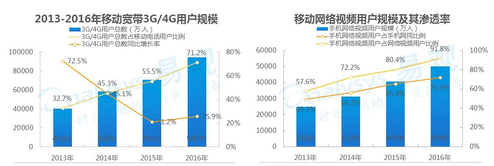
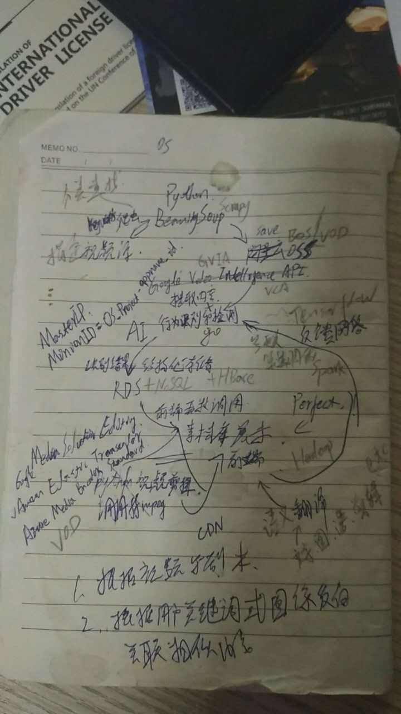
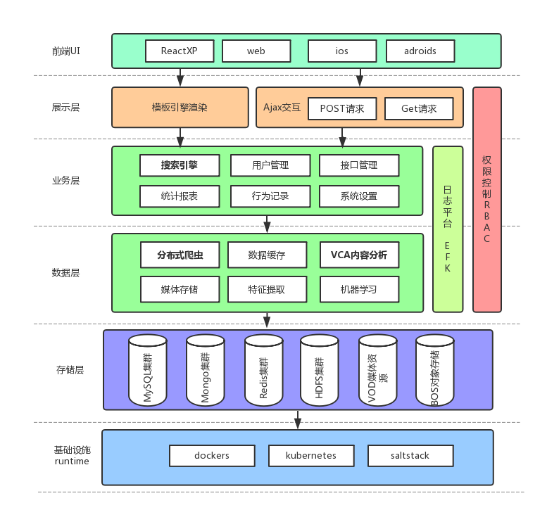
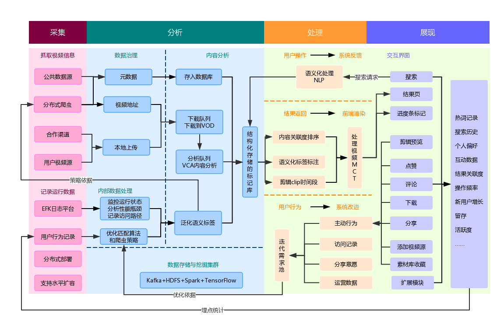

## 从零开始打造语义化视频搜索引擎(始)、有一个改变世界的idea，就缺个程序员了

#### 本章知识点
1. [需求的产生](#需求的产生)
2. [可行性调研](#可行性调研)
3. [围绕需求进行系统架构与技术选型](围绕需求进行系统架构和技术选型)
4. [开发流程及规划](#开发流程及规划)
5. [系统架构图](#系统架构图)
---

#### 需求的产生

&#160; &#160; &#160; &#160;随着网络资费日益降低和带宽大幅提升，视频和语音正逐步取代文字、图片，成为我们传递和获取信息的主要手段。然而关于音视频检索的技术却乏陈可书，我们现在要找一个视频，都只能靠片名或者自己搜索枯肠提炼的关键字去查找，如果视频的上传者没有添加相应的分类、标签或名称，那就算对我们再有价值的内容都会无缘得见。更何况大多数时候，不同人的生活经验和观察角度不同，对同一段音视频都会有完全不同的理解，对其进行的描述更会大相径庭，这进一步减低了我们获取到有效信息的可能性。

&#160; &#160; &#160; &#160;用户就算有幸找到视频，那你想要的内容是哪一段呢？这又是一个更费时费力费事的事情。一部视频短则三五分钟，长则数个小时，你不得不挨秒地观看是否潜藏着你想要的信息。有可能你想找的信息就那几秒，却不得不看几十分钟甚至更长时间与你要找的目标完全无关的东西，这还没把现在很多视频网站动不动就几分钟的广告算进去。很多时候还会被肆意横行的标题党所累，看完整部葫芦娃，却没有看到你懂的内容。即便快进浏览以期减少浪费的时间，既在挑战网速，又有遗漏信息的风险，最后已经搞不清是你在调戏进度条，还是进度条在调戏你。你的时间和生命就这样大段大段地耗费在了无用的事情上，而你只是单纯地想通过某一小段视频获取想要的信息而已。

&#160; &#160; &#160; &#160;音视频的草根创作者们更是痛苦，精心制作有价值的内容，如果不是自带话题或者流量很难得到有效的传播。上传视频时，不但要绞尽脑汁地取个好名字，还要自己手动地输入一大堆自开脑洞的标签，因为只能指望通过这些让观众发现和品鉴自己的心血之作。为了播放量，不得不违心地在标题党、擦边球、污妖王等等三俗套路上徘徊，真正有营养的作品被掩藏，逐渐劣币驱逐良币。并且难有沉淀，观众看过听过也就过去了，想起来温故知新要回头再看也困难重重到放弃，很多本来具备长期价值的内容就此被埋没。特别是对于课程、演讲、科普、记录、讲座、培训等视频内容，长期价值很高，而现阶段的利用率因为上述原因却极低。

&#160; &#160; &#160; &#160;平台方的日子也好不到哪去，随着视频数据量的爆发增长，各大视频网站以前那种人工进行审核、编辑、分类、标注的方式，不但成本高企，更是已经越来越不能满足不同用户角色的各种需求，很难适应发展的需要。另外一方面随着服务器存储和带宽资源成本的降低，自身的技术壁垒也在逐步消解，不得不依靠加大IP资源，购买版权等对内容的投资来应对激烈的竞争。再加上前述人工成本的上升，对资本的要求也更高，甚至要牺牲用户体验，靠生硬的植入广告，长达数分钟的片头、插播或者会员体系来谋求利润。

&#160; &#160; &#160; &#160;有没有什么方案能一举多得地解决所有人都存在的痛点之源呢，其实是有可借鉴的先例的，语言是人类进化过程中产生，用来信息交流的伟大发明，已经形成了根深蒂固的认知习惯。而视频的本质也只是信息的载体，只是这种载体信息量过于丰富，计算机不能自行理解，形成结构化的数据以供人们检索，只能人肉观看识别。而只要视频能够转化为语义化的“剧本”，所有问题就都可以在我们现有的技术手段和认知范围内迎刃而解

&#160; &#160; &#160; &#160;这就确定我们要做的事了，一句话总结，就是我们的标题：语义化视频搜索引擎

现在我们有一个好想法, 就缺个程序员了:)

#### 对需求的深入分析

&#160; &#160; &#160; &#160;我们通常会拿到这么一句话的需求，就要直接开干，就问你怕不怕:)，幸好这次是自己做主，我们可以将需求再具化一些

&#160; &#160; &#160; &#160;要实现我们的这个小目标，就是通过爬虫将网络上视频抓取，让AI帮助我们不眠不休地“观看”这些视频，并通过智能接口分析出不同时间节点的视频片段上的内容，解构出标签、语言、画面内容等数据，生成视频切片信息，我在这形象化地称之为“剧本”，加以结构化存储，最后再根据用户的语义化搜索按匹配度算法，将经过标记的相应片段和视频源呈现给用户，让用户快捷的找到他所需要的视频内容。

再进一步归纳下，需要做到以下几点：

- 全网抓取视频，以备分析
- 将所有视频变成“剧本”，便于检索和查找
- 语义包括画面内容和语音识别的字幕：能表达出视频画面中什么时间有什么在做什么或说什么
- 能够作为用户在云端的媒体剪辑素材库
- 根据用户互动和行为改进爬虫策略及匹配算法

我们不生产视频，我们是内容的探索者。

#### 可行性调研

&#160; &#160; &#160; &#160;理想很丰满，现实太骨干，其他方面都没有什么问题，但摆在我们面前有一只巨大的拦路虎，那就是将视频变成“剧本”这一过程需要大量的技术积累和研发投入。

&#160; &#160; &#160; &#160;一个项目的正式执行，除了技术实现，还需要系统化思维地考虑SWOT、前期调研、商业环境、项目预算、赢利模式、政策变化、运营策略、内容监管、市场竞争、团队资源……这里作为范例讲解，就一笔带过了。同时希望同学们有这样的意识：一个项目，是team集体智慧的产物，大家齐心协力把他当做工程问题来解决，没有孰轻孰重，任何环节的不足都有导致整体崩盘的可能。而且不同时期的实现成本也大相径庭，这都需要结合我们对行业的持续观察和新技术的不断学习，来保持敏锐的技术嗅觉。对时机的把握至关重要，而这个时机正在这场智能革命的大潮中悄然来袭，把之前的不可行变成了可行。

&#160; &#160; &#160; &#160;3-5月份Google提前公开，在IO大会上发布了基于GCP的视频智能分析接口的内部测试版本[Video Intelligence API(private beta)](https://cloud.google.com/video-intelligence/#demo)，目前已经发展到beta版，演示朴实无华，却又激动人心————这不正是我们自身无法解决那个核心问题的方案吗

&#160; &#160; &#160; &#160;这么有潜力的应用场景，当时就猜百度应该也早就在干这个事了吧，果不其然大概两周后，百度大脑就放出了[视频内容分析VCA](http://ai.baidu.com/tech/video/vca)，但明显不像NLP、OCR、TTS甚至Apollo这些产品是在可用状态才推出，能够直接被使用。VCA为了应对商业竞争的发布有些仓促，根据其介绍，却不乏亮点，对我们的项目有极大帮助：
- 集成了语音识别，相当于自动生成了字幕，有助于对内容的理解
- 集成了OCR，识别画面中的文字内容，包括字幕、标题、弹幕等信息
- 集成了人脸识别，目前虽然只有百度的公众人物库，但也对内容形成补充
- 集成了NLP，对自然语言进行了处理，更加符合我们语义化的要求

&#160; &#160; &#160; &#160;简单地说，VCA这一个接口，囊括了几乎所有AI功能，与自动驾驶相比，只是少了结合电气信息技术的控制能力，功能上非常能满足我们的需要。从综合检验技术成效的角度，视频内容分析较之自动驾驶，试错成本几乎可以忽略不计，技术实现在可预期的时间上完全可控，技术所占的话语主导权要大得多，相对而言也不太受外部环境、合作渠道和政策法规的影响，并且两者带来的社会效应相差无几，VCA完全可以作为自动驾驶技术成熟之前过渡期的练兵场。搞不明白贾跃亭和李彦宏为什么非要无视自身积累的海量视频资源，一上来就想一步登天地搞自动驾驶，然后不可避免地陷于财务上的被动，或许这就是让人不太能理解的有钱任性吧。如此看来就是万事俱备了，然而实际的开发更需要结合自身资源现状，明确项目目标，才能做好规划安排

#### 根据资源情况修正项目目标
&#160; &#160; &#160; &#160;我们需要把想法落地，同时必须接受客观条件的限制。在这里请允许我再次原文引用一遍[阿里云CTO王坚博士](https://www.zhihu.com/question/30681093/answer/64634714)说过，让我印象最深刻的一句话：一个能用好云计算的公司，哪怕只有一个人，也可以拥有10000人公司的计算能力，曾经被跨国巨头垄断的计算能力。

&#160; &#160; &#160; &#160;理论上是可以拥有这么大的算力，前提是你要有足够的money::joy::，要一上来就处理所有视频不太现实，但我们可以为这一天的到来提前做好布局规划。以下是原始需求关联的几大核心难点在demo阶段的相应对策：

- 搜索范围：个人有个偏好，就是超爱各种CG，是暴雪电影制片人的脑残fans，所以本demo项目将处理能爬取到的CG
- 视频时长：CG一般情况下不会超过10分钟，其中包含多个片段的组合方式信息存储在数据库中
- 支持格式：跟随MCT为FLV、MP4、HLS、MP3、M4A
- 响应时间：不同做法区别极大，目前只找到采取预抓取分析和缓存结果的方式，这样带来的弊端就是实时性和搜索范围有限，相对可以接受
- 媒体目录：同一视频画面的识别结果会多层嵌套，demo中限制嵌套三层
- 匹配效果：内容分析会有关联度数据，还需要通过用户的选择形成正向反馈
- 展现形式：极简化，搜索结果的展现内容不规范，适合瀑布流加载的形式
- 个性化：搜索历史和偏好记录，使结果更符合用户预期，可以支持收藏和下载
- 扩展性：能够支持无缝水平扩展，规模化扩张，现有的运维方案已经较为成熟，能够预先做好规划安排，在发展过程中解决问题
- 稳定性：互联网应用需要提供无间断服务，服务特别是基础设施需要满足高可用要求

#### 围绕需求进行系统架构和技术选型
复述下个人总结做系统架构的几大前提核心点
- 首先是对业务的的深刻理解
- 第二是对发展的正确认识
- 第三是对环境的客观研判
- 第四是对资源的有效调配
- 第五是对技术的综合运用

最后还必须要落脚于整体规划，以及推进执行上，同时也要明白架构是演化出来的，而不是设计出来的。接来下我们将以上务虚的理论，在具体实践中进行落地
1. 主开发语言
基于视频单位存储价值密度极低的特点，对时间和资源的开销都是极大的，所以后端对高性能和高并发提出了硬性要求，人生苦短，我选go：
- 21世纪的C，唯一与C在性能上没有数量级差距的高级程序语言
- 非常适合处理服务器端云计算和并发要求较高的项目使用
- 高效，极低延迟的垃圾回收和内存管理
- 将在1.10中集成包管理工具dep
- 高速编译，出错自带堆栈跟踪，调试便捷
- 吸纳C、Java、Python、PHP等其他语言的优点，迁移学习曲线平缓，能够快速上手
- 主流云基础设施[kubernetes](https://github.com/kubernetes/kubernetes)、[prometheus](https://github.com/prometheus/prometheus)、[docker](https://github.com/docker/docker-ce)、[etcd](https://github.com/coreos/etcd)、[flannel](https://github.com/coreos/flannel/)等的选择
- 最吸引我的他是能够[编译自举](https://github.com/golang/go)的高级语言，之前的C和Delphi也能做到，但说多了都是眼泪。这一点在一直想做的自主进化的设想中至关重要
2. 基础设施需要做到水平扩容和对微服务及大数据的支持
- 从成本和功能上测算，单纯的云服务不能完全满足我们的定制化需求，使用SaltStack+Kubernetes搭建私有云集群
- 全局容器化
- 需要使用代理服务器方案，解决实际环境中你懂的一些问题
3. 开发支持体系
- DevOps是很必要的，直接将底层资源调度和集成部署细节屏蔽，使开发更关注于核心业务
- 开发测试与生产环境一致且隔离，容器化技术使他们相互关联而又互不影响，开发环境和数据随时和生产环境的备份同步
- 统一规范的日志采集，方便调试，性能优化，问题定位，最主要还要看上去华丽酷炫:)，采用与k8s深度结合的EFK插件
- 节省时间，提高效率
4. 分布式爬虫
- 由于视频分析处理时间是主要的性能瓶颈，爬虫首要满足的是稳定性需求，Python scrapy是较为成熟的方案
- 反爬虫的对策，代理服务器列表抓取和测试，以及其他一些必要措施
- 大量现成案例可供参考和直接使用
- 共用的可伸缩Redis集群，可以根据对爬取效率的要求调整资源配额
- 爬取状态监控跟踪，以调起后续分析处理流程
- 组件化，后续如果对爬取效率有更高要求，可升级为go，前期开发与python同步进行，节省人力时间
6. 搜索引擎
- 视频的智能分析国内目前只有选择[百度VCA](http://ai.baidu.com/tech/video/vca)，这也将关联到其他很多资源的选择。国外可以选择[Google VIA](https://cloud.google.com/video-intelligence/#demo)
- 作为核心系统对性能和并发要求高，使用go开发
- 调用的智能接口和提供的API都是JSON数据，数据库存储采用NoSQL的MongoDB集群来保存性能更高
- 数据储存由于VCA的缘故，只能选择媒体资源库VOD和对象存储BOS
- 根据查询请求生成视频剪辑，选择MCT

7. 客户端
- 跨全平台的客户端，[weex基本处于玩票](https://github.com/apache/incubator-weex)，[ReactXP](https://github.com/Microsoft/reactxp)满足一套代码，全平台支持的要求，由于是新框架，其体验和兼容性还有待考察
- 初期为便于推广和使用直接开发微信小程序端应用
- 对用户互动和行为需要做记录以监控运营效果和改进搜索结果
- 结合统一的日志事件管控平台EFK，进行埋点
- 极简的界面和交互设计，不忘初心，让用户更快找到他所需要的内容
- 多层级的视频片段标记，适合用瀑布流加载方式，预览图为每个片段的首帧
8. 大数据
- 目前主流的选择是[Hadoop生态的全家桶](https://github.com/apache/hadoop)HDFS+Hbase，现在有了备用选择，仍然是go家族的[gleam](https://github.com/chrislusf/gleam)+[seaweedfs](https://github.com/chrislusf/seaweedfs)
- 流式处理采用经典的[Spark家族](https://github.com/apache/spark) Streaming + MLib + GraphX
- 消息队列有三大主流选项备选[Kafka](https://github.com/apache/kafka)、[RabbitMQ](https://github.com/rabbitmq)、[RocketMQ](https://github.com/apache/incubator-rocketmq)，[阿里中间件团队关于三者的评测](http://jm.taobao.org/2016/04/01/kafka-vs-rabbitmq-vs-rocketmq-message-send-performance/),对于我们项目而言，对高并发类日志的处理才是重点，所以这里选择Kafka，同时可用于EFK的消息传递
- 数据可视化，复用EFK中的[Kibana](https://github.com/elastic/kibana)
9. 机器学习
- 最主流的ML框架：[TensorFlow](https://github.com/tensorflow/tensorflow)
- 多算法模块管理：[Tensor2Tensor](https://github.com/tensorflow/tensor2tensor)
- 根据实际的运营数据多种机器学习算法效果的横向比较
- 通过对比对匹配算法参数调优，再通过新产生的用户行为检验效果，形成监督学习的正向循环
10. 扩展系统
- 组件化的功能模块，便于后期拓展搜索引擎相关的其他应用
- 所有组件独立，可单独替换和升级，其上下游组件使用数据快照仍能够正常运行
11. 软件版本选择和管控
- 同一版本的向下兼容性需要有所保证，否则很可能带来架构调整的后果
- 相互协作的软件最低版本支持问题
- 不同版本之间特性差异化，主要体现在很多开源软件的社区版和商业版
- 开发与生产环境软件版本需要统一
- 通常选择稳定的stable版，对于个别需要release版特性的场景要确保可控性，原则上任何情况都不自动更新latest版
- 自行维护的rc和hotfix也需要在测试环境指定好版本和依赖关系
- 所有版本控制通过集群的salt统一配置和分发，以确保整体的一致性

&#160; &#160; &#160; &#160;注意:实际的选型工作还需要配合测试数据和使用经验等综合因素，做出更细致精确的考量和研判

#### 系统架构图
经过以上环环相扣的分析，用架构图的直观方式来总结下我们的设计
原始设计图

美化下的分层架构图

然后是数据流图

系统架构到此就告一段落了，各个子系统架构图会在相应章节给出

#### 开发流程及规划
&#160; &#160; &#160; &#160;由于本文用作demo讲解，涉及到项目管理上的内容，就不过多赘述，重点讲一下技术方向的前景规划

1. 如果能对流媒体进行处理，对接直播或监控的话，那就相当于我们的所有视频流随时都由AI在帮我们盯着，可以随时知道当前世界正在发生的事情，再结合更成熟和稳定的语义特征算法，一些异常情况可以实时警报甚至预警，防患于未然，这带来的社会价值和意义将非常巨大
2. 可以结合语音和图像识别，加以语义处理和视频内容进行匹配，做到真正的想要什么就呈现什么，也是交互体验很好的升级
3. 参考以图搜图的模式，通过视频片段来搜索视频，方便地找到视频出处和与之关联的更多视频，人人都可以是老司机
4. 能找到某些片段出现在哪些视频中，对版权保护也能起到很大作用
5. 开放视频上传和视频源添加，用户能够让系统分析指定的多媒体资源，作为高效实用的私有媒体目录Saas平台，多媒体创作者的素材库
6. 通过对上传视频的权限控制，还能运作成为很有吸引力的多媒体发布渠道

---

&#160; &#160; &#160; &#160;希望本文能让读者了解到如何综合运用技术手段解决实际问题的完整流程，纸上得来终觉浅，绝知此事要躬行，学以致用很重要。一直以来全身心投入各位东家热火朝天的共产主义建设当中，难得借机会将一些琐碎记录做一个总体梳理，于是就有了这篇文字记录，多年后重新动笔，感觉身体被掏空，无论如何，和笔者一起经历这从无到有的奇妙过程吧

文中借鉴和引用了多个开源项目和文章，都会尽最大可能给出fork和reference的原始出处，如有遗漏请联系作者编辑。

---

#### [章节目录](#本章知识点)
- **始、我有一个改变世界的idea，就缺个程序员了**
- [一、SaltStack搭建Kubernetes集群管理架构基础设施](一、SaltStack搭建Kubernetes集群管理架构基础设施.md)
- 二、EFK+Jenkins可扩展的DevOps自动化运维部署及监控体系
- 三、使用Python scrapy开发分布式爬虫进行数据采集
- 四、VCA+go打造高性能语义化视频搜索引擎
- 五、Hadoop+Spark Streaming+GraphX实现大数据的流式计算和可视化
- 六、ReactXP开发跨全平台的客户端程序
- 七、将用户行为反馈接入机器学习框架TensorFlow进行算法调优
- 终、以终为始，不是终点的终点